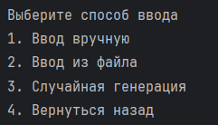
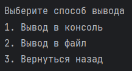
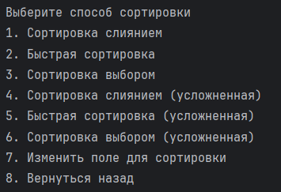
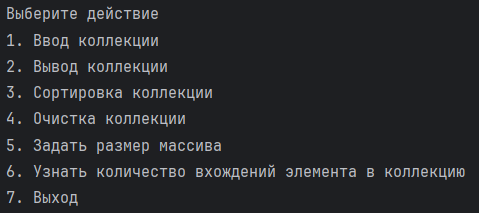

# Aston Final Project - Sorting Application

## Описание проекта

### Требования

| Tool  | Version |
|------|---------|
| Java | 17+     |
| Maven| 3.6+    |

Данный проект представляет собой консольное Java-приложение, реализующее **3 алгоритма сортировки кастомных классов** 

- MergeSort,
- QuickSort,
- SelectionSort.

## Выбранный класс для сортировки

В проекте реализован кастомный класс **Студент**:
- Номер группы
- Средний балл
- Номер зачетной книжки

---

## Функциональные возможности

### Основной функционал

- Выбор способа заполнения коллекции:
  - ручной ввод данных
  - загрузка данных из файла
  - генерация случайных значений

  

- Выбор способа вывода коллекции:
  - консольный вывод
  - вывод в файл

  

- Выбор способа сортировка и сортируемого поля для усложненных видов сортировки:
    - сортировка слиянием 
    - быстрая сортировка
    - сортировка выбором
    - сортировка слиянием (усложненная)
    - быстрая сортировка (усложненная)
    - сортировка выбором (усложненная)
    - изменение сортируемого поля

  

- Очистка коллекции
- Выбор размера коллекции
- Подсчет количества вхождения элементов

  

---

## Тестирование

В проекте использовались следующие инструменты для тестирования:
- **JUnit** — для модульного тестирования
- **Mockito** — для создания мок-объектов

В проекте реализованы **JUnit тесты**:
- тестирование алгоритмов сортировки,
- проверка валидации входных данных,
- проверка кастомной коллекции.

